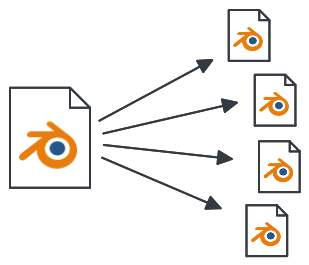
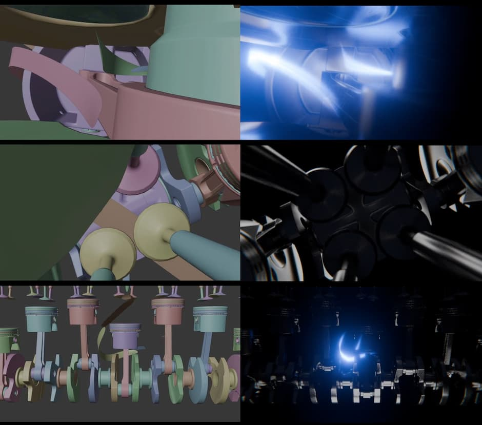
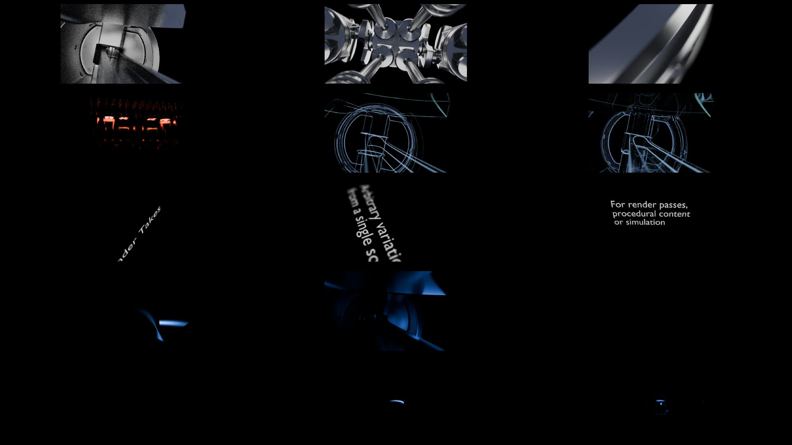

# Blender Takes



A workflow for arbitrary variations (_takes_) from a single Blender file.

The included [demo-file](#run-the-demo) is used to generate _takes_ (in this case render-passes) for compositing:

Comparison of viewport and composite (click link to watch):

[](https://echtzeit-drei.de/assets/takes_demo_web.mp4)

Contact-sheet of all _takes_ used in the demo (all starting at the same time, click to watch):

[](https://echtzeit-drei.de/assets/contactSheet_web.mp4)

## What is this?

The output of a single Blender file can be many things:

- rendered image
- asset
- simulation
- ...

Usually it is necessary to create variations of these outputs:

- rendered image
  - different object states (visibilities, holdouts)
  - backgrounds
  - different materials
  - additional isolated lights
  - varied render settings (preview/production)
  - ...
- asset
  - low/high poly
  - sliced animation geometry and final render geometry
  - rendered asset turntables from different viewing angles
  - variations of procedurally generated assets
  - ...
- simulation
  - wedges: varied seeds to test simulation settings
  - ...

This workflow uses a Blender file as a single source of truth to create consistent output repeatedly.

Almost everything in Blender can be controlled with Python. Variations on a scene are described with Python snippets. These snippets are run on the scene from the command-line and the result is saved in a new blender file.

## Why

Especially in Visual-Effects, rendered output (_passes_) from the computergraphics-department is layered in _compositing_ to create the final image.
During compositing, new passes might be requested.

The list of specialised rendered output from the same scene grows.

On top of that, artistic changes might be requested by supervisors or clients:
e.g. a change in camera-animation can happen at any time and affects all generated output.

Ideally, you want to implement this change once in one place.

All output that was created up to now should then be generated again, programmatically.

## How does it work

**Takes** are described as Python functions inside a text data-block in the Blender file.
These functions are never called from within the text data-block, so the changes are not accidentally applied.
Instead, a command-line script executes the takes on the Blender file and saves the result as a new Blender file.

Two _takes_ that switch the render engine could look like this:

```py
import bpy

def take_cycles():
    bpy.context.scene.render.engine="CYCLES"

def take_eevee():
    bpy.context.scene.render.engine ="BLENDER_EEVEE_NEXT"
```

From the command-line, a script (`takes.py`) is run on the file with specified take-names.
This executes the functions and saves a blender file for each take:

```sh
# Generate specific takes:
blender --background --factory-startup workfile.blend --python takes.py -- take_cycles take_eevee
# Generate all takes:
blender --background --factory-startup workfile.blend --python takes.py --
```

The generated files can then be used for rendering.

## Run the demo

Clone this repository and run:

```sh
# Linux
blender --background --factory-startup demo.blend --python takes.py --
```

The demo file uses `utils.py` as an external script inside Blender.

The generated _takes_ are saved into a folder called `output` next to the Blender file.

The generated files are used for rendering, not for actual work! Every change must be applied to the source file from which the output can be re-generated.

## Best Practices

##### Use Collections / Don't operate on objects directly

Do not rely on object names.

<br>

##### Use Objects in several collections

Objects can be linked to many collections.
This helps in creating different sets of renderable objects (e.g. just a couple of objects as holdouts).

<br>

##### Hide all collections first, then show only what needs to be rendered

```py
def take_beauty():
    # functions from utils.py
    hide_all()
    show(["asset1", "lights"])
    world("sky")
```

This ensures the produced render is not messed up by objects that have been added to the scene.

<br>

##### Inherit a variation

Takes can be inherited by simply calling other takes or utility functions:

```python
def preview_settings():
    bpy.context.scene.render.resolution_percentage = 50
    bpy.context.scene.cycles.samples = 100

def take_beauty():
    preview_settings() # call another take or utility function
    hide_all()
    show(["asset1", "lights"])
```

<br>

##### Do not call a take definition inside the Blender-file

Takes can be destructive: data-blocks, like objects, can be deleted to optimize the final output.

Therefore, you do not want to run a take in the workfile!

<br>

##### Don't work in a generated take

Inspect the generated takes for sanity-checks, troubleshooting and testing.
**But apply all changes to the source-file!**

<br>

##### This is not foolproof

This workflow is bare-bones, not foolproof and requires some mental load.
But it is very powerful in a fast-turnaround production environment.
